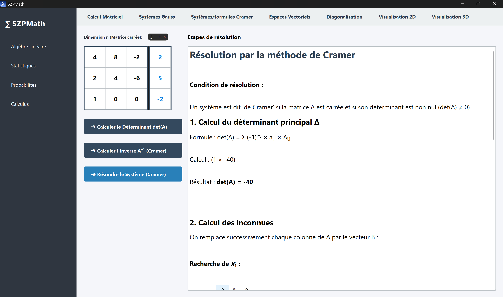
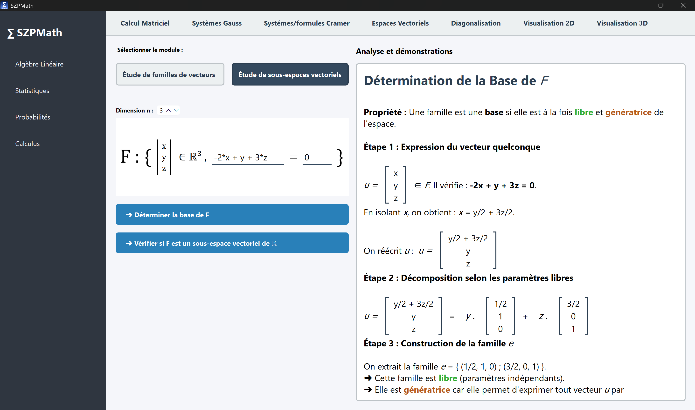
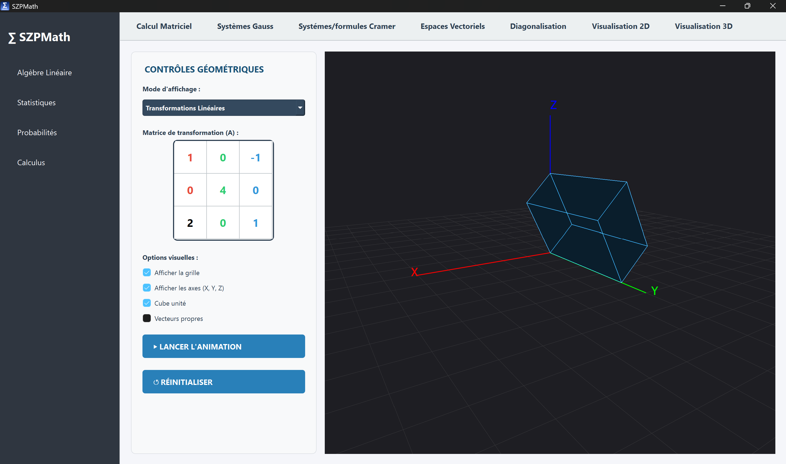
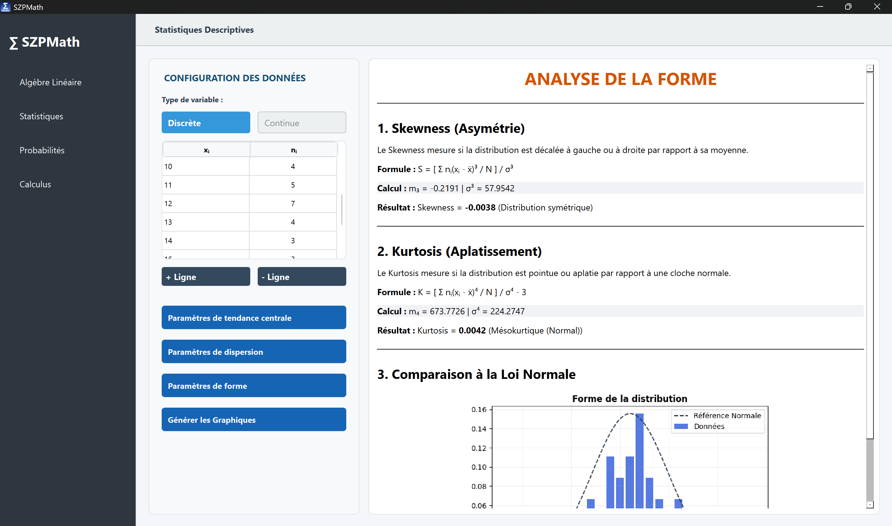
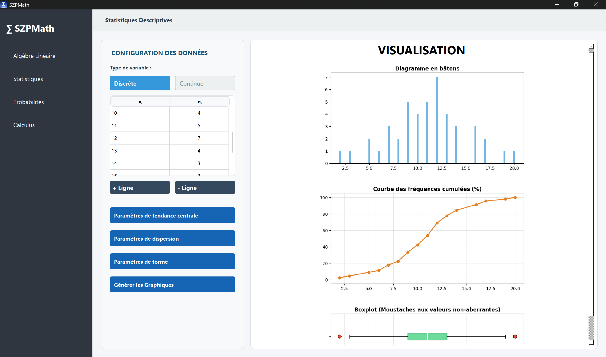
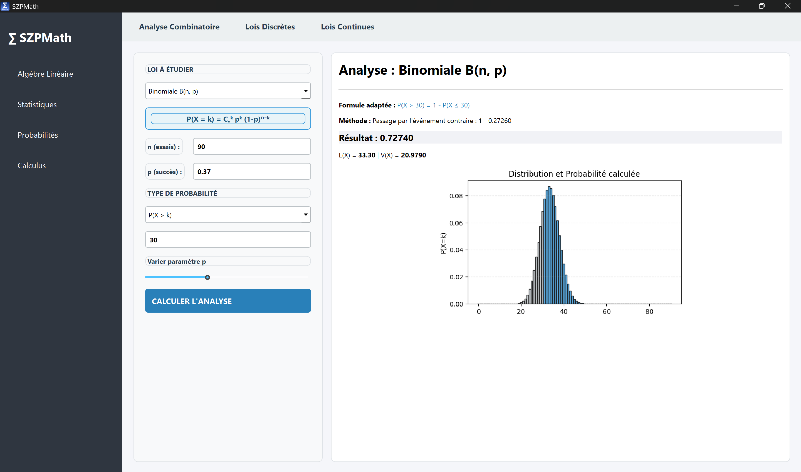
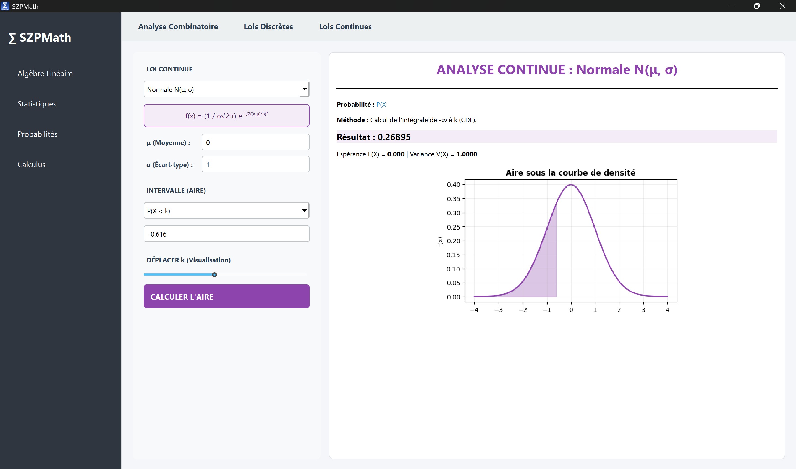
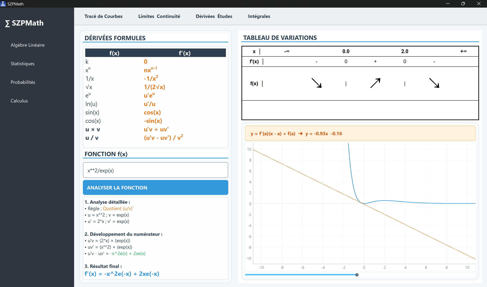

# SZPMath (Alpha v1.0)
 **English Version** | [Version Française](./README.fr.md)\
 SZPMath is a powerful educational tool dedicated to advanced mathematical computing, designed to offer a smooth, dynamic and interactive interface. The main objective is to offer precise and detailed explanations to complex mathematical concepts, allowing students to locally study, discover and practice theory. Developed using Python 3.13, it combines the computing power of NumPy and MatPlotLib with a modern UI under PySide6.\
 Availible on Windows, MacOS and Linux.

 **Note :** : While this documentation is in English to reach a broader audience, the application interface and logs are currently available only in French. Future versions will include full translation.

## Features
**Linear Algebra** : Matrix operations, linear system solvers (Gauss, Cramer), vector space analysis, diagonalization, dynamic 2D and 3D rendering of linear transformations and combinations.

**Calculus** : Interactive visualization of complex functions, study of limits/continuity, and derivative/integral calculus.

**Statistics** : Detailed analysis of discrete and continuous data series : central tendency, dispertion and shape parameters, with graphical and boxplot visualization.

**Probabilities** : Arrangements, interactive analysis of discrete (Binomial, Poisson, Geometric) and continuous (Normal, exponential) distributions.

## Technical Stack (2026 edition)
The project uses the latest stable versions of the scientific python libraries, guaranteeing performance and compatibility :

**GUI** : PySide6 (v6.8.2) for a modern user experience and high DPI screen resolution compatibility.

**Core computing** : NumPy (v2.2.0+) for intensive and complex numerical computing, combined with SymPy for optimized symbolical computing.

**Visualization** : 

OpenGL (v3.1.10) for smooth complex 2D & 3D rendering.

PyQtGraph (v0.13.3) for real-time interactive graphs.

Matplotlib (v3.10.x) high grade statistic renders.

**Packaging** : PyInstaller for autonomous multi-platform executable distributions.

## Installation (User)
To download the software (as a .exe), follow the user guide for the latest release : https://github.com/theoszpn/SZPMath/releases/

## Installation (Dev/Source code)
To clone the project and run locally :

**To clone :**

**Bash**\
git clone https://github.com/theoszpn/SZPMath.git
cd SZPMath

**To create a virtual environment (Recommended) :**

**Bash**\
python -m venv .venv \
_MacOS_ : source .venv/bin/activate \
_Windows_ : .venv\Scripts\activate

**To download dependencies :**

**Bash**\
pip install -r requirements.txt

**To start application :**

**Bash**\
python main.py

## Project Structure

SZPMath_aplha/\
├── assets/\
├── modules/\
│&nbsp;&nbsp;&nbsp;&nbsp;&nbsp;├── algebra/\
│&nbsp;&nbsp;&nbsp;&nbsp;&nbsp;├── calculus/\
│&nbsp;&nbsp;&nbsp;&nbsp;&nbsp;├── probas/\
│&nbsp;&nbsp;&nbsp;&nbsp;&nbsp;└── statistics/\
├── main.py\
├── .gitignore\
├── README.md\
├── requirements.txt\
└── screenshots/

## Roadmap & Future evolutions

[ ] User authentification system.

[ ] Local saving of computations (SQLite database)

[ ] Premium version integration very advanced features (tensor calculus, machine learning)

[ ] Graph export in pdf/LateX format.

## Developed by **SZAPPANYOS Théo**, Project completed as part of a technical portfolio (February 2026).

## Appendices :

**Screenshots | Linear Algebra**

**Screenshots | Statistics**

**Screenshots | Probabilities**

**Screenshots | Calculus**

